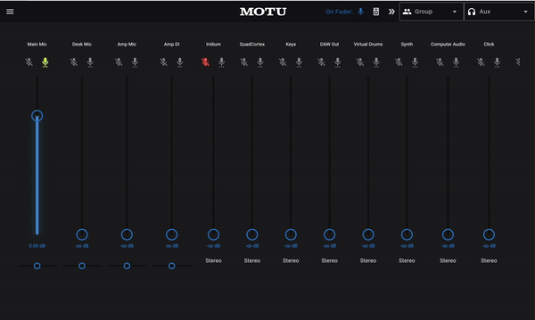
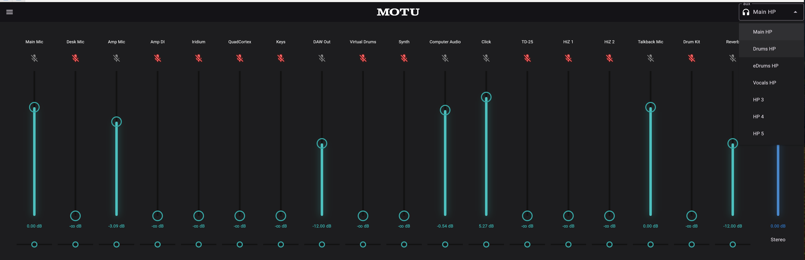
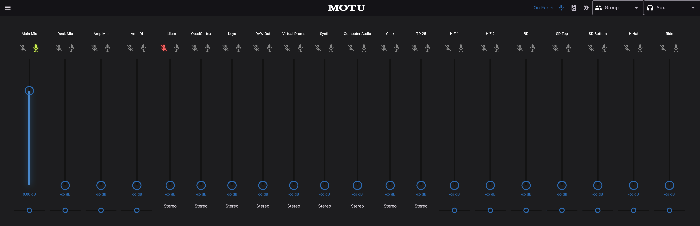
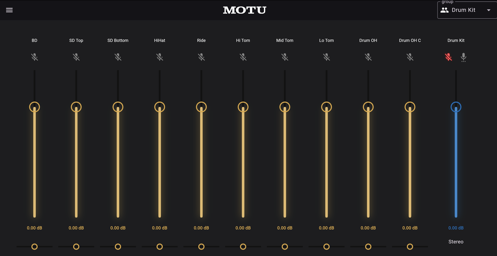
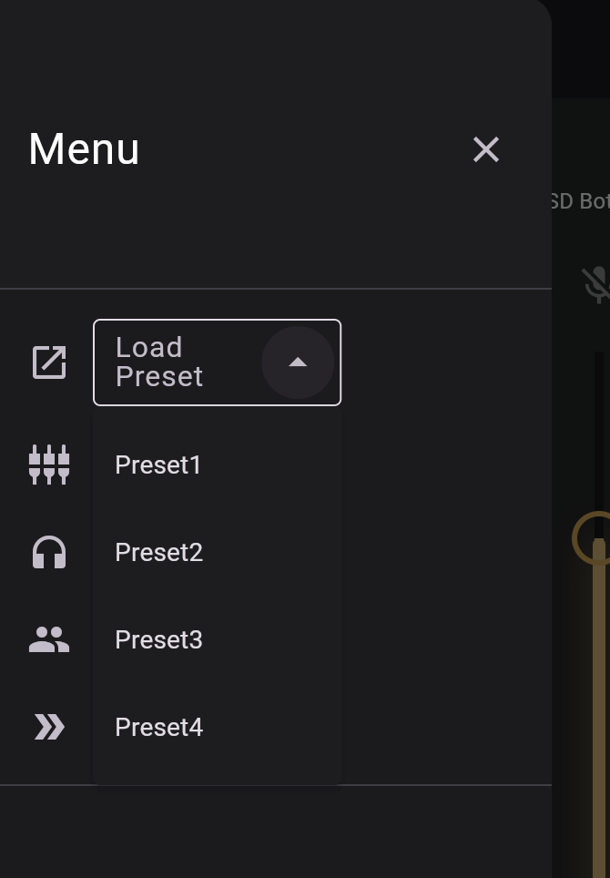
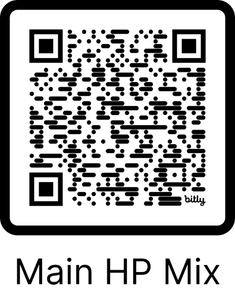

# Simple MOTU AVB Controller

A flutter app for controlling MOTU AVB interfaces through a simplified UI.

This app enables a custom-configured UI for controlling subsets of faders, panners and buttons without the need to use the MOTU interface's full Touch Console UI.
An example use case would be exposing various aux headphone mixes for individuals to control.

This app is inspired by and uses components from the [MOTU Simple Control Panel](https://github.com/Hecsall/motu_simple_control_panel) project.

## Usage

### Demo Site

A Live demo using the development server can be found [here](https://bit.ly/motu-control-main-hp-mix).

### Sreenshots

#### Screen Recording

#### Aux Page

#### Mixer Page

#### Group Page

### Preset Selection

### Encoding Settings

The app can take json settings as base64-encoded string in the querystring. For an example of how to encode settings, see: https://dartpad.dev/?id=ebe05ff8e6a8f21b5995ab14ddb8377d

### Direct Links

A good use case for this app is to have links directly to a page with a particular setup using the path and base-64 encoded settings in querystring. For example: [link with base64-encoded settings in querstring](https://motu-avb-controller.web.app/#/aux/0?settings=eyJkZXZpY2VVcmwiOiJodHRwOi8vbG9jYWxob3N0Ojg4ODgvZGF0YXN0b3JlIiwiYXV4TGlzdCI6WzAsMiw0LDYsOCwxMCwxMl0sImdyb3VwTGlzdCI6WzAsMiw0XSwiZ3JvdXBJbnB1dExpc3QiOnsiMCI6WzI0LDI1LDI2LDI3LDI4LDI5LDMwLDMxLDMyLDM0XSwiMiI6W10sIjQiOltdfSwiYXV4SW5wdXRMaXN0Ijp7ImNoYW4iOnsiMCI6WzAsMSwyLDMsNCw2LDgsMTAsMTIsMTQsMTYsMTgsMjAsMjIsMjMsMzVdLCIyIjpbMCwxLDIsMyw0LDYsOCwxMCwxMiwxNCwxNiwxOCwyMCwyMiwyMywzNV0sIjQiOlswLDEsMiwzLDQsNiw4LDEwLDEyLDE0LDE2LDE4LDIwLDIyLDIzLDM1XSwiNiI6WzAsMSwyLDMsNCw2LDgsMTAsMTIsMTQsMTYsMTgsMjAsMjIsMjMsMzVdLCI4IjpbMCwxLDIsMyw0LDYsOCwxMCwxMiwxNCwxNiwxOCwyMCwyMiwyMywzNV0sIjEwIjpbMCwxLDIsMyw0LDYsOCwxMCwxMiwxNCwxNiwxOCwyMCwyMiwyMywzNV0sIjEyIjpbMCwxLDIsMyw0LDYsOCwxMCwxMiwxNCwxNiwxOCwyMCwyMiwyMywzNV19LCJncm91cCI6eyIwIjpbMF0sIjIiOlswXSwiNCI6WzBdLCI2IjpbMF0sIjgiOlswXSwiMTAiOlswXSwiMTIiOlswXX19fQ==
)

With these links, it's possible to create QR codes for each headphone aux mix and place them around the studio next to headphone stations for artists to directly manipulate their own headphone mixes from the app. e.g

# Resources

* [Create QR codes to link to specific pages](https://qr.io/?gad_source=1&gclid=Cj0KCQjw2ou2BhCCARIsANAwM2Foj3xuU22vQvYHm1j5nSIhCL1I0NzoNgpxReLyFZ1YOOXrvMoR7ysaAubkEALw_wcB)
* For Datastore API, see [MOTU AVB Datastore API Docs](https://cdn-data.motu.com/downloads/audio/AVB/docs/MOTU%20AVB%20Web%20API.pdf)